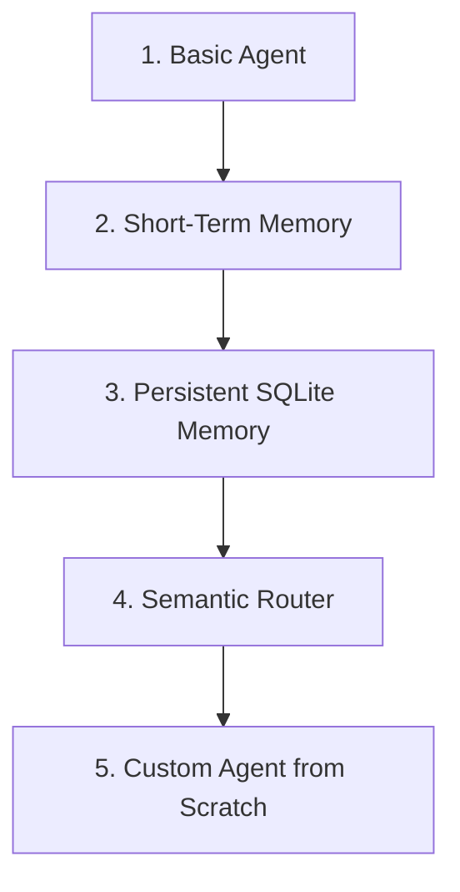

# AI Agent & Semantic Router Playground

Welcome to the **AI Agent & Semantic Router Playground**! This repository is a step-by-step learning environment designed to build, understand, and optimize custom AI Agents, conversational memory, persistent database checkpointers, and semantic routing classification.

---

## 📂 Project Architecture & Milestones

This project is structured as a progression of five milestones:



### 1. Basic Agent (`basic_agent.py`)
* **Goal**: Build a financial research analyst agent (`FinBot`) using LangChain and ChatGroq.
* **Tools**:
  * Stock Fundamentals (`yfinance`)
  * Latest Financial News (`YahooFinanceNewsTool`)
  * Robust Wikipedia Search (custom wrapper handling redirects, ambiguities, and errors)
  * Last 24h Google News Search (`SerpAPIWrapper`)
* **Command to run**: `uv run python basic_agent.py`

### 2. In-Memory Session Memory (`agent_with_memory.py`)
* **Goal**: Enable the agent to keep context across multi-turn messages within a conversation thread.
* **Implementation**: Uses LangGraph's `InMemorySaver` checkpointer and unique `thread_id` configurations.
* **Testing**: Demonstrates that the agent understands pronouns (e.g., *"it"* in *"How does it compare to NVDA?"*) by recalling previous prompts.
* **Command to run**: `uv run python agent_with_memory.py`

### 3. Persistent SQLite Memory (`agent_persistant_memory.py`)
* **Goal**: Persist message context securely across multiple process restarts.
* **Implementation**: Uses LangGraph's `SqliteSaver` checkpointer to save message histories in a local `finance_agent.db` database.
* **Testing**: Running the script a second time recalls your name and interest without sending them in the prompt again.
* **Command to run**: `uv run python agent_persistant_memory.py`

### 4. Semantic Router & Optimization (`agent_semantic_router.py`)
* **Goal**: Setup a zero-latency routing layer using `semantic-router` and a local HuggingFace embedding model (`Qwen/Qwen3-Embedding-0.6B`) to classify queries.
* **Implementation**: Routes queries into `stock_analysis`, `market_news`, `general_finance`, or Out-of-Scope (`None`).
* **Optimization**: Benchmarks accuracy before and after running `router.fit()` (Threshold Optimization) to build customized boundary limits.
* **Command to run**: `uv run python agent_semantic_router.py`

### 5. Custom Agent Without LangChain (`custom_agent.py`)
* **Goal**: Build a pure-Python tool-calling agent using the raw `groq` SDK to understand the internal event loop.
* **Implementation**: Handles JSON tool declarations, calls Groq, parses tool invocation requests, runs local Python functions, appends results, and loops back recursively.
* **Command to run**: `uv run python custom_agent.py`

---

## 🛠️ Installation & Setup

This repository uses **`uv`**, the ultra-fast Python package manager.

### 1. Install Dependencies
Initialize the environment and sync packages from `pyproject.toml` automatically:
```bash
uv sync
```

### 2. Configure Environment Variables
Create a `.env` file in the root directory:
```env
GROQ_API_KEY=your_groq_api_key_here
GROQ_MODEL=openai/gpt-oss-safeguard-20b
SERPAPI_API_KEY=your_serpapi_api_key_here
```

---

## 📈 Optimization Results (Semantic Router)

After defining our dataset and training the router, we observe a significant improvement in accuracy by optimizing thresholds:

* **Accuracy Before Optimization**: ~68.57% (using standard/generic boundaries)
* **Accuracy After Optimization (`fit()`)**: ~71.43% (up to +2.86 percentage point improvement)
* **Out-of-Scope Filter**: Accurately filters out random queries like *" banana bread recipe"* or *"weekend movies"* without executing expensive LLM runs.
